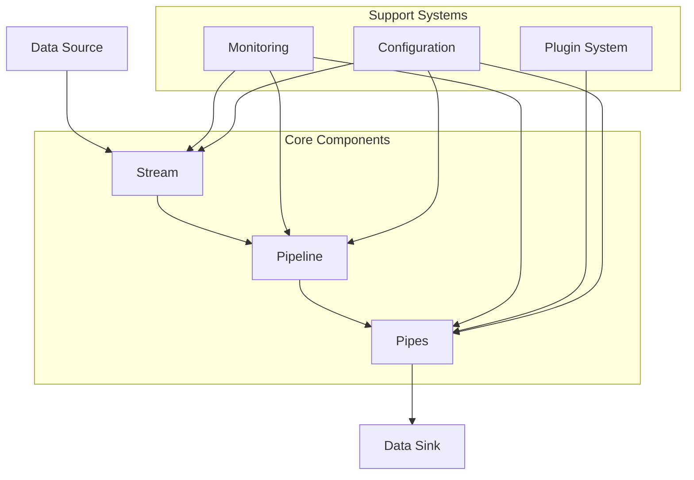
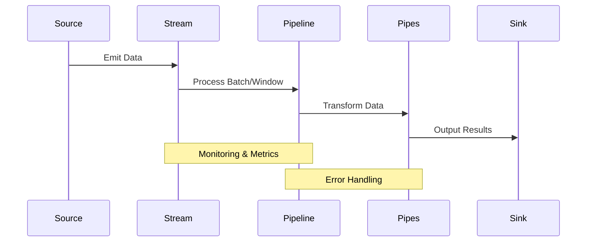

# Rivusio Architecture

## Overview

Rivusio is a high-performance data processing framework built on modern Python, designed for both synchronous and asynchronous data processing pipelines. This document outlines the core architecture and design principles.

## Core Components

## Component Details

### 1. Stream Processing
- **AsyncStream/SyncStream**: Handle data streaming with support for:
  - Batching
  - Windowing
  - Error handling
  - Backpressure (planned)

### 2. Pipeline
- **Pipeline Management**: Orchestrates the flow of data through:
  - Multiple pipes
  - Error handling
  - Monitoring
  - Resource management

### 3. Pipes
- **Base Pipes**: AsyncBasePipe and SyncBasePipe
- **Configurable Pipes**: Support for configuration injection
- **Plugin System**: Extensible architecture for custom pipes

### 4. Monitoring
- **Metrics Collection**: Runtime statistics and performance metrics
- **Pipeline Monitor**: Specialized monitoring for pipeline execution
- **Error Tracking**: Comprehensive error handling and reporting

### 5. Plugin System
- **Registry**: Central plugin management
- **Dynamic Loading**: Runtime plugin discovery
- **Type Safety**: Strong typing for plugin interfaces

## Data Flow

## Design Principles

1. **Type Safety**
   - Strong typing throughout the system
   - Runtime type checking
   - Pydantic integration for data validation

2. **Extensibility**
   - Plugin system for custom components
   - Configurable pipeline behavior
   - Custom monitoring integration

3. **Performance**
   - Efficient batch processing
   - Async/sync support
   - Resource management

4. **Reliability**
   - Comprehensive error handling
   - Monitoring and metrics
   - Testing and validation

## Future Enhancements

See our [TODO](https://github.com/zbytealchemy/rivusio/blob/main/TODO.md) for planned improvements and enhancements.
